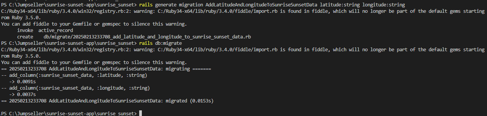
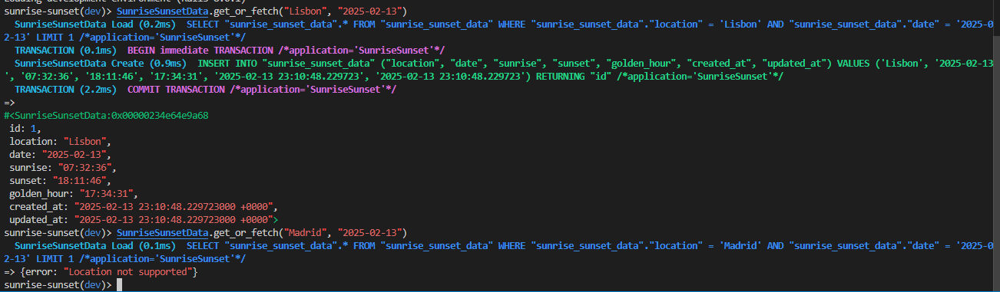

# sunrise-sunset-app

Since I'm more familiar with Pyhton, Java and .NET I will describe all the steps that I did just in organization purposes.

## What was done

Here I will explain what I did in order to develop this project.

Knowing that is my first time working with Ruby On Rails, first I installed Ruby. After I need to install the Bundler to manage dependencies and in the end Rails.

Now that I chose the DB we can use rails db:create to create it.

To start the server I used: rails s

In order to create the Model and Migration files I will use "rails generate model SunriseSunsetData location:string date:date sunrise:string sunset:string golden_hour:string"

Now let's apply the migration: rails db:migrate and confirm it: rails dbconsole

Now that we are in sqlite we can use .tables to check which tables we have

Time to create the controller: rails generate controller SunriseSunset

I needed to add 2 more columns to the table: 

# To test

Open Rails console: rails c

Test manually: SunriseSunsetData.get_or_fetch("Lisbon", "2025-02-13")

SunriseSunsetData.get_or_fetch("Madrid", "2025-02-13") -- should give error

